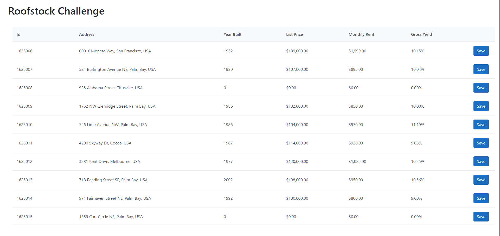

# Roofstock Full stack Coding Exercise

## Application info and features

There’re two parts
1. Create a ASP.NET (or Core), Angular, Web Project (MVC/SPA) to display fields

Data source from API:
- https://samplerspubcontent.blob.core.windows.net/public/properties.json

Display the records in a table/grid with following fields
- Address
- Year Built
- List Price $ (formatted to two decimal places - e.g. $120,000.00)
- Monthly Rent $ (formatted to two decimal places - e.g. $1,234.00)
- Gross Yield % ('Monthly Rent' * 12 / 'List Price') - e.g. 12.55%

Property details 

2. Saving record from above into database table Properties
- Create a SQL Server database with a table named Properties to store all the fields displayed above
- Update the above to support record saving
- Add a Save button to each row
- When the Save Button is clicked, the record should be inserted into the new table Properties

**Any technology can be used (ADO.NET, any ORM [Entity Framework | NHibernate | whatever])**

## Tech Info

- ASP.Net Core 3.1
- Linq2DB
- AutoMapper
- SQL Server 2019
- Angular 10


## General Deployment Instructions

1. Clone the repository:
    ```sh
        $ git clone https://github.com/rmendoza83/roofstock-fullstack-challenge roofstock-fullstack-challenge
    ```

2. Move to the new cloned folder:
    ```sh
        $ cd roofstock-fullstack-challenge
    ```

3. Move to the Angular project folder:
    ```sh
        $ cd roofstock-fullstack-challenge/RoofstockChallenge.Web/ClientApp
    ```

4. Prepare the angular project:
    ```sh
        $ npm install
        $ npm build --prod
    ```

5. Prepare the Database on some SQL Server Instance (SQLExpress or another), create a new Database with the name **RoofstockDB** and create a new table using the following script:
    ```sql
    SET ANSI_NULLS ON
    GO
    SET QUOTED_IDENTIFIER ON
    GO
    CREATE TABLE [dbo].[Properties](
    	[Id] [int] IDENTITY(1,1) NOT NULL,
    	[RawId] [int] NOT NULL,
    	[Address] [varchar](250) NOT NULL,
    	[YearBuilt] [int] NOT NULL,
    	[ListPrice] [decimal](18, 2) NOT NULL,
    	[MonthlyRent] [decimal](18, 2) NOT NULL,
     CONSTRAINT [PK_Propertie] PRIMARY KEY CLUSTERED 
    (
    	[Id] ASC
    )WITH (PAD_INDEX = OFF, STATISTICS_NORECOMPUTE = OFF, IGNORE_DUP_KEY = OFF, ALLOW_ROW_LOCKS = ON, ALLOW_PAGE_LOCKS = ON, OPTIMIZE_FOR_SEQUENTIAL_KEY = OFF) ON [PRIMARY]
    ) ON [PRIMARY]
    GO
    ```

6. Open the solution **RoofstockChallenge.sln** with Visual Studio 2019 and set the Connection String for the database created in the previous step, editing the file *appsettings.json* and updating the key **RoofstockDBConnection**, one example of the file *appsettings.json* should be like this:  
    ```json
        {
        	"Logging": {
        		"LogLevel": {
        			"Default": "Information",
        			"Microsoft": "Warning",
        			"Microsoft.Hosting.Lifetime": "Information"
        		}
        	},
        	"AllowedHosts": "*",
        	"ConnectionStrings": {
        		"RoofstockDBConnection": "Server=.\\SQLExpress;Initial Catalog=RoofstockDB;Persist Security Info=False;User ID=sa;Password=secret;MultipleActiveResultSets=False;Encrypt=False;TrustServerCertificate=False;Connection Timeout=180;"
        	}
        }
    ```
7. Compile and Run the solution.

8. Done.

## Some screenshots of the application



## Contact

* Reinaldo Mendoza - rmendoza83@gmail.com